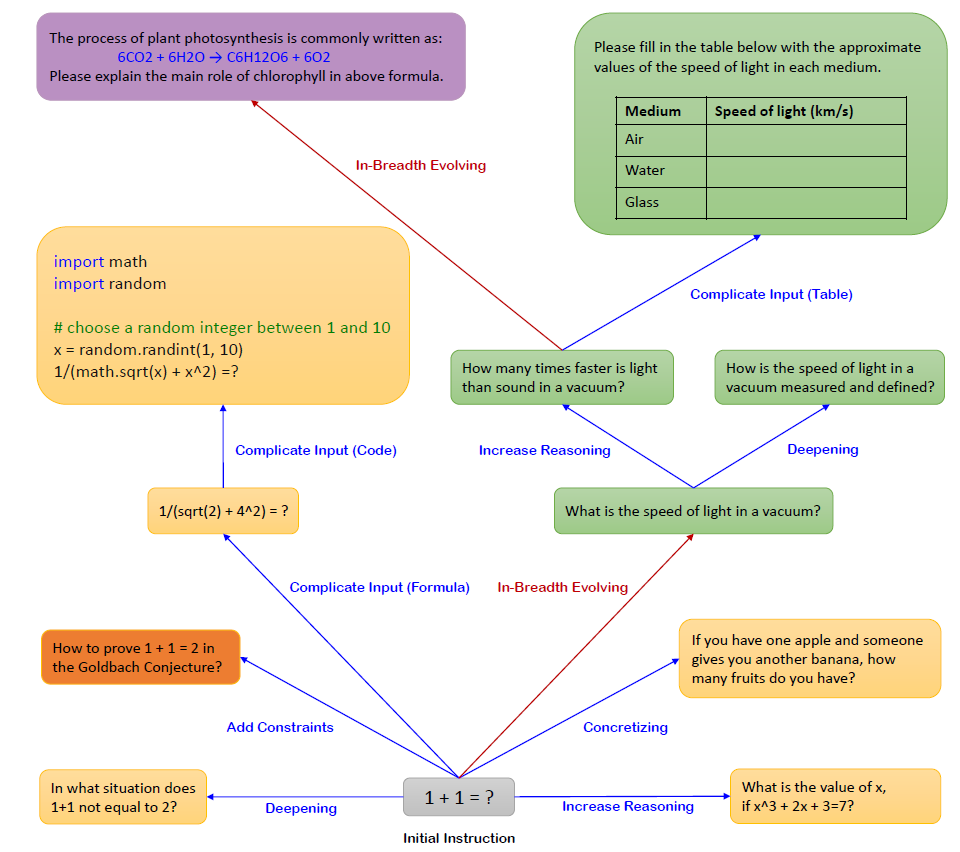

# Evol-Instruct

The repo for instruction evolution, we will update more details of the Evol-Instruct algorithm and various code variants here in the future

## Running Example
Details pls refer to [paper](https://arxiv.org/abs/2304.12244)

